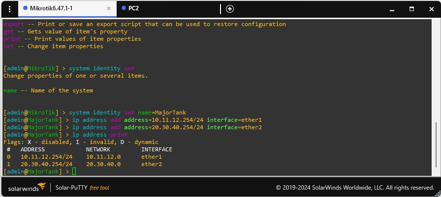

## Introduction

GNS3 (Graphical Network Simulator-3) is a powerful network emulation tool that allows network engineers to design, configure, test, and troubleshoot virtual and real networks. Whether you're running a small topology on your laptop or managing multiple devices across servers, GNS3 provides the environment you need for network simulation.

## Prerequisites

- A computer running Windows, Mac, or Linux
- Administrative privileges on your computer
- VMware Fusion (Mac) or VMware Workstation (Windows)
    - Note: Do not use VMware Player as it lacks VIX API support
    - VirtualBox is supported but not officially tested

## Installation Process

### 1. VMware Installation

1. Install VMware Fusion (Mac) or VMware Workstation (Windows)
2. If you're a Pacific student, you can obtain free licenses through SOECS

### 2. GNS3 Software Installation

1. Visit [www.gns3.com](https://www.gns3.com/)
2. Click "Free Download"
3. Select your operating system
4. Create a GNS3 Community Account when prompted
5. Download and run the installer with default options
    - Note: On Mac, allow ubridge root permissions when prompted

### 3. GNS3 VM Installation

1. Download the VM image:
    - Go to [GNS3 VM download page](https://www.gns3.com/software/download-vm)
    - Select "VMware Workstation and Fusion" version
2. Setup the VM:
    - Extract the downloaded .zip file
    - Open VMware
    - Import the .ovf file ("GNS3 VM.ovf")
    - Keep the default name "GNS3 VM" for easier setup

### 4. GNS3 Initial Configuration

1. Launch GNS3
2. Complete the setup wizard:
    - Choose "Run appliances in a virtual machine"
    - Accept default server settings
    - Configure VM settings:
        - CPU: 1 core
        - RAM: 2048MB
3. Allow VMware to launch the GNS3 VM automatically

### 5. MikroTik Router Installation

1. Download Router OS:
    - Visit [mikrotik.com](https://mikrotik.com/)
    - Go to Software section
    - Download the Cloud Hosted Router (CHR) raw disk image
2. Configure in GNS3:
    - Open Preferences → QEMU → Qemu VMs
    - Create new template:
        - Name: "MikroTik [version]"
        - RAM: 256MB
        - Console: Telnet
        - Network adapters: 4
        - Rename ports: Ether1 through Ether4
    - Set category to "Routers"
    - Choose router symbol
    - Set shutdown to "Send the Shutdown Signal (ACPI)"

## Creating Your First Network

### Network Setup

1. Create new blank project

    
3. Add components:

    
    - 2 Virtual PCs (VPCS)
    - 1 MikroTik router
4. Connect devices according to diagram:

   
    - PC1 ↔ Router (Ether1)
    - PC2 ↔ Router (Ether2)


### Device Configuration

### Router Setup:


```bash
Login: admin (no password)
> ip address add address=10.11.12.254/24 interface=ether1
> ip address add address=20.30.40.254/24 interface=ether2
> ip address print

```

### PC1 Setup:


```bash
PC1> ip 10.11.12.1/24 10.11.12.254
PC1> save

```

### PC2 Setup:


```bash
PC2> ip 20.30.40.1/24 20.30.40.254
PC2> save

```

### Testing Connectivity


From PC1:

```bash
PC1> ping 20.30.40.1

```

## Troubleshooting Guide

### Common Issues

### Hyper-V Conflict Resolution

If you encounter VMware errors related to Hyper-V on Windows:

1. Open PowerShell as Administrator
2. Run the following commands:
    
    ```powershell
    Disable-WindowsOptionalFeature -Online -FeatureName Microsoft-Hyper-V-All
    bcdedit /set hypervisorlaunchtype off
    
    ```
    
3. Restart your computer
4. If issues persist, also check and disable these Windows features:
    - Windows Subsystem for Linux (WSL)
    - Virtual Machine Platform
    - Windows Sandbox
    - Windows Hypervisor Platform

Note: After disabling Hyper-V, some Windows features like WSL2 and Windows Sandbox won't work. You'll need to re-enable Hyper-V if you want to use these features again.

### VM Connection Issues

1. Cannot connect to GNS3 VM:
    - Verify VM web interface accessibility
    - Check port settings (should be 80)
    - Reset virtual network adapters
    - Verify VMnet configuration

### Upgrading

1. GNS3 Client:
    - Allow automatic updates when prompted
2. GNS3 VM:
    - Access VM console
    - Select "Upgrade" option
    - Choose matching version with client

## Best Practices

1. Install GNS3 on native OS, not in a VM
2. Save configurations frequently
3. Stop all devices before closing projects
4. Keep GNS3 client and VM versions synchronized
5. Monitor resource usage when running multiple devices

## Additional Resources

- Official Documentation:
    - [Windows Guide](https://docs.gns3.com/docs/getting-started/installation/windows)
    - [Mac Guide](https://docs.gns3.com/docs/getting-started/installation/mac)
    - [Linux Guide](https://docs.gns3.com/docs/getting-started/installation/linux)
