# Lab 2: Introduction to RouterOS

## Overview
In this lab, we will:
- Configure a basic network topology using GNS3
- Learn essential RouterOS commands
- Analyze network traffic using Wireshark
- Configure and test network connectivity between subnets

## Network Diagram
```
[PC1]                        [PC2]
192.168.50.10               192.168.60.10
     |                           |
     |                           |
[Ethernet Switch]---------------[Router]
                          .1 /        \ .1
                 192.168.50.0/24  192.168.60.0/24
```
## Network Requirements

### Subnet 1 (192.168.50.0/24)
- VPC with IP: 192.168.50.10
- Router Ether1 port: 192.168.50.1

### Subnet 2 (192.168.60.0/24)
- VPC with IP: 192.168.60.10
- Router Ether2 port: 192.168.60.1
- One Ethernet Switch

## Step-by-Step Instructions

### 1. Network Setup
1. Create new project named "lab02"

2. Add required components:
   - 2 Virtual PCs (VPCS)
   - 1 MikroTik router
   - 1 Ethernet Switch
  
   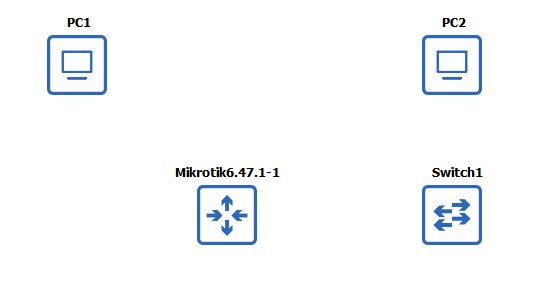

3. Connect devices according to the diagram:

   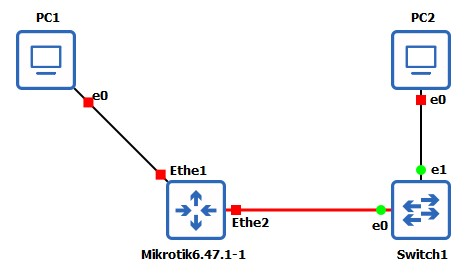

5. Start all devices:

   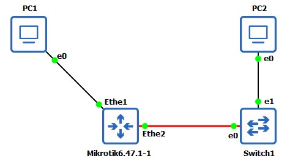

7. Open consoles for PCs and router:

   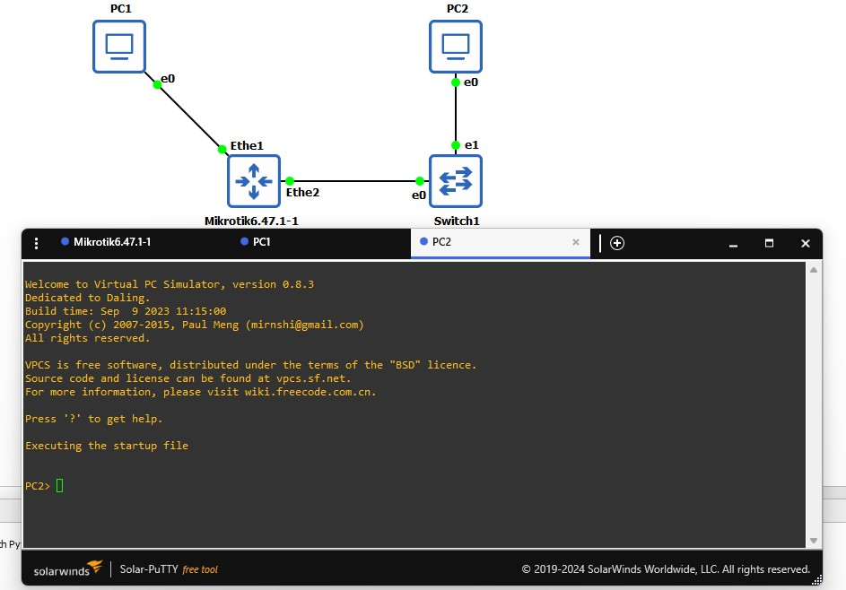

### 2. Router Configuration

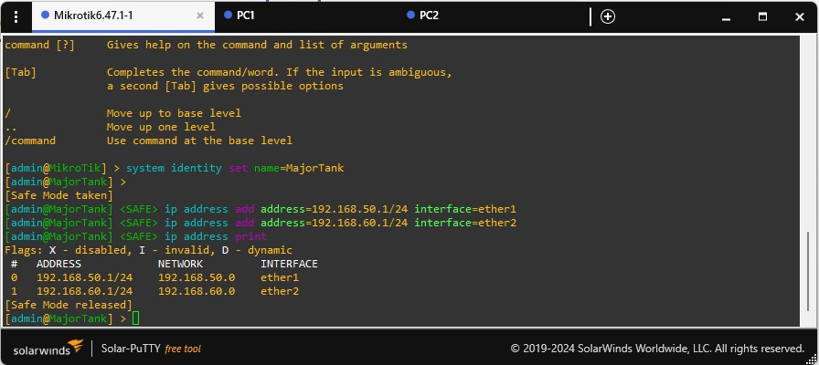
```
# Login
Username: admin
Password: [leave blank]
[N to license prompt]

# Enter Safe Mode
[CTRL-X]

# Configure interfaces
ip address add address=192.168.50.1/24 interface=ether1
ip address add address=192.168.60.1/24 interface=ether2
ip address print

# Set router identity
system identity print
system identity set name=YOUR-ROUTER-NAME
system identity print

# Exit Safe Mode to save
[CTRL-X]
```

### 3. PC1 Configuration

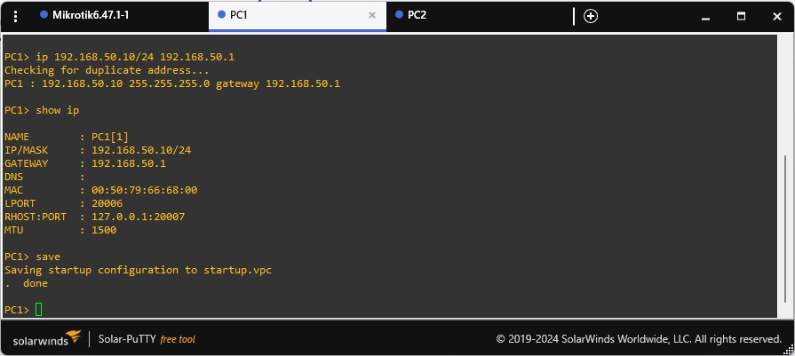
```
# Configure IP and gateway
ip 192.168.50.10/24 192.168.50.1
show ip
save
```

### 4. PC2 Configuration

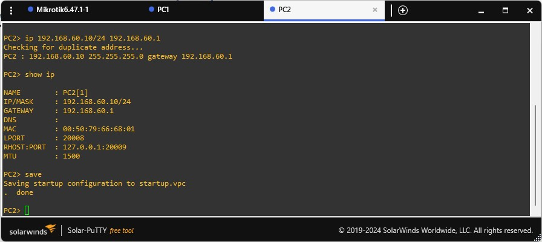
```
# Configure IP and gateway
ip 192.168.60.10/24 192.168.60.1
show ip
save
```

### 5. Testing Connectivity

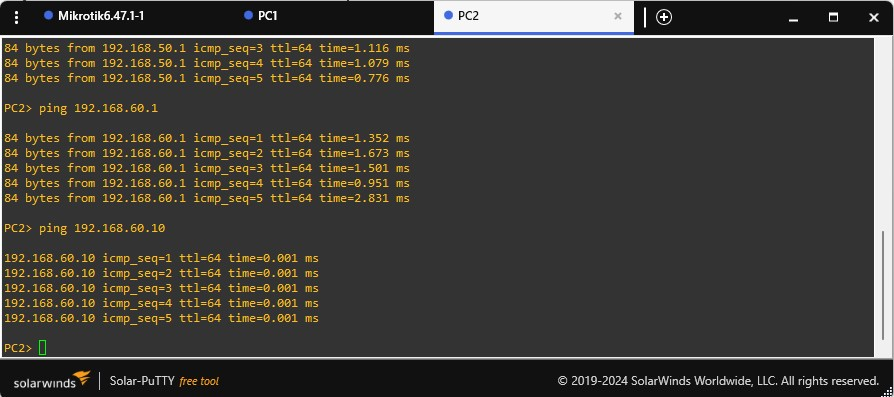
From PC1:
```
# Test local router interface
ping 192.168.50.1

# Test remote router interface
ping 192.168.60.1

# Test PC2
ping 192.168.60.10
```

## RouterOS Exploration Tasks

### Command Investigation
1. Test the help system:

   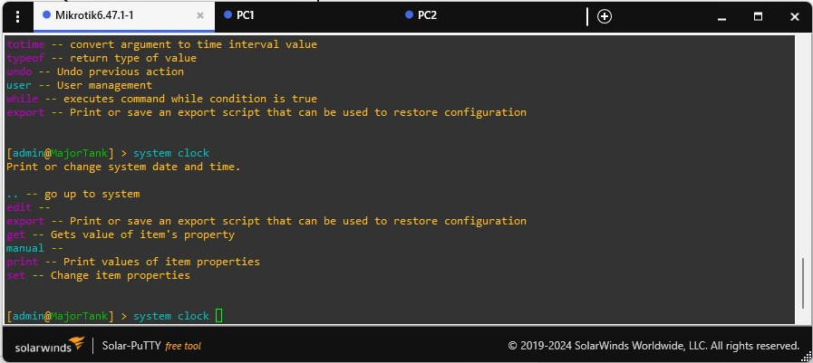
   - Enter `?`
   - Enter `system clock ?`
   
3. Clock configuration:

   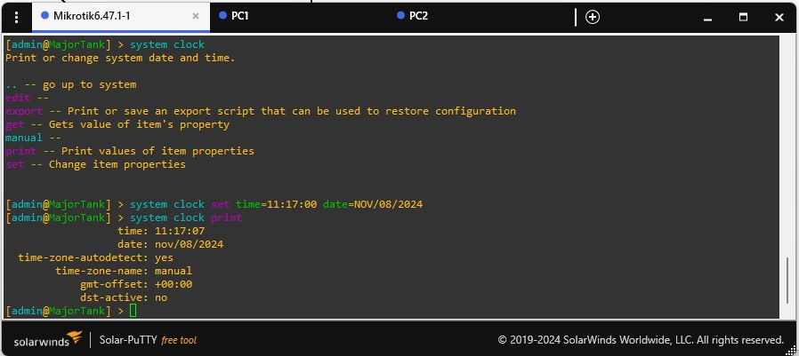
   ```
   system clock set time=HH:MM:SS date=mon/dd/yyyy
   system clock print
   ```

5. Interface information:

   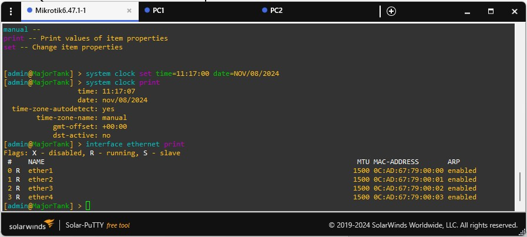
   ```
   interface ethernet print
   ```
   Note down:
   - MAC address of ether1
   - MTU value

## Wireshark Analysis

### Setup
1. Install Wireshark from [wireshark.org](http://wireshark.org/) if needed
2. Start packet capture:
   - Right-click the link between PC1 and router
   - Select "Start Capture"
   - Keep default filename
   - Enable "Start the capture visualization program"

### Capture Analysis Tasks
1. Generate traffic:
   - From PC1, ping PC2
   - Observe packet flow in Wireshark

2. Analysis points to document:
   - Differentiate between outgoing and incoming ping packets
   - Compare source MAC addresses:
     * ICMP request packets vs PC1 MAC
     * ICMP response packets vs Router ether1 MAC
   - Note transport layer protocol usage
   - List other protocols observed

### Stopping Capture
Right-click the link and select "Stop Capture" when finished

## Tips
- Always use Show/Hide Interface Labels button for better topology visibility
- Configure router before PCs as it serves as the gateway
- Save configurations frequently
- When examining MAC addresses, pay attention to source vs destination fields

## Additional Notes
- GNS3's simple switch doesn't require configuration
- Port numbers on the switch don't matter - it learns device locations automatically
- Future labs may explore GNS3's Packet Filters for network degradation testing

## Troubleshooting
- If links stay RED after starting devices, check physical connections
- Verify IP addresses and subnet masks match exactly
- Ensure router interfaces are enabled
- Confirm gateway addresses on PCs match router interface IPs
- If no connectivity between subnets, verify router routing table with `ip route print`
