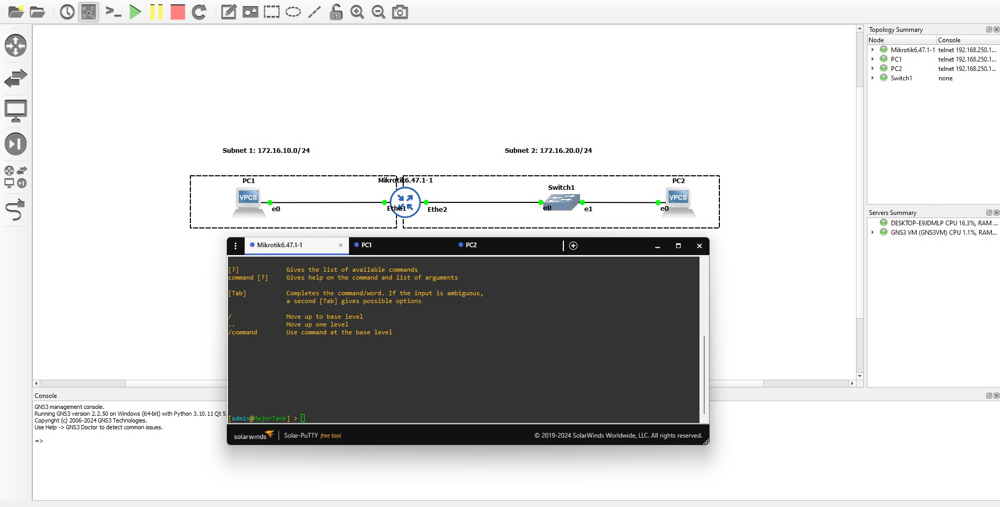

# Networking Labs

This repository contains a series of hands-on networking laboratories designed to provide practical experience with various networking concepts, protocols, and technologies using GNS3 (Graphical Network Simulator-3).

## Overview

These labs cover fundamental to advanced networking topics, providing hands-on experience with:
- Network simulation using GNS3
- Routing protocols (static and dynamic)
- Network addressing and subnetting
- Network services (DHCP)
- Network security (VLANs, Firewalls)
- Advanced networking concepts (NAT, GRE, IPv6)
- Software-Defined Networking

## Prerequisites

- GNS3 installed and configured on your system
- Basic understanding of networking concepts
- RouterOS knowledge (will be developed throughout the labs)

## Lab Structure

| Lab | Topic | Description | Date |
|-----|-------|-------------|------|
| 1 | GNS3 Setup | Install and configure GNS3 on your computer and setup your first network topology | Aug 31, 2020 |
| 2 | Intro to Router OS | Use RouterOS to route between two subnets | Sep 14, 2020 |
| 3 | Static Routing | Create static routes to inform the router about the location of subnets that are not directly attached | Sep 21, 2020 |
| 4 | Dynamic Routing | Use dynamic routing protocols to allow the router to automatically learn the location of distant subnets | Sep 28, 2020 |
| 5 | Custom Subnets | Create your own network subnets given some design constraints | Oct 5, 2020 |
| 6 | DHCP | Enable Dynamic Host Configuration Protocol (DHCP) on subnets to simplify client network configuration | Oct 12, 2020 |
| 7 | VLANs | Configure VLANs on the switches and router to provide for network isolation between sets of hosts on the same physical network | Oct 19, 2020 |
| 8 | Firewalls | Configure a Firewall to restrict network access according to administrative requirements | Oct 26, 2020 |
| 9 | Network Address Translation | Connect your virtual GNS3 topology to the Internet and configure Network Address Translation (NAT) on a router | Nov 2, 2020 |
| 10 | GRE and OSPF | Use a GRE tunnel and OSPF routing to connect a "remote" business office to a "headquarters" business network | Nov 9, 2020 |
| 11 | IPv6 | Configure a dual-stack network to support both IPv4 and IPv6 | Nov 16, 2020 |
| 12 | OpenFlow | Configure a routed network that uses Software-Defined Networking (SDN) over OpenFlow Layer 3 switches | Nov 30, 2020 |

## Repository Structure

Each lab is contained in its own directory with the following structure:
```
LabX-Topic/
├── README.md         # Lab instructions and requirements
├── topology/         # GNS3 topology files
├── configs/         # Configuration files and scripts
└── screenshots/     # Documentation images
```

## Getting Started

1. Clone this repository:
```bash
git clone https://github.com/[username]/Networking-Labs.git
```

2. Install GNS3 by following the instructions in Lab 1
3. Complete each lab in sequence, as concepts build upon previous labs

## Learning Objectives

By completing these labs, you will:
- Gain practical experience with network simulation tools
- Understand and implement various routing protocols
- Learn to configure and troubleshoot network services
- Develop skills in network security implementation
- Experience modern networking concepts like SDN

## Contributing

Feel free to submit issues and enhancement requests. For major changes, please open an issue first to discuss what you would like to change.

## License

[MIT](https://choosealicense.com/licenses/mit/)

---

## Resources

- [GNS3 Documentation](https://docs.gns3.com/)
- [RouterOS Documentation](https://wiki.mikrotik.com/wiki/Manual:TOC)
- [OpenFlow Specification](https://opennetworking.org/software-defined-standards/specifications/)
